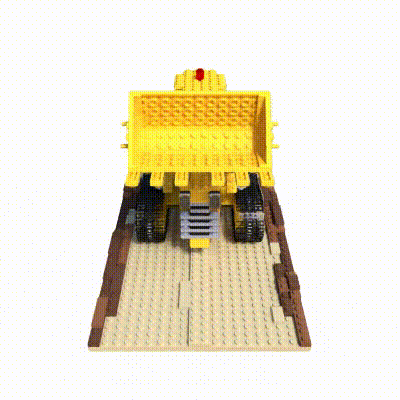

# A Reconstruction of NeRF

> Reference: [nerf-pytorch](https://github.com/yenchenlin/nerf-pytorch)

## Usage

#### Download Data

```shell
./download_example_data.sh
```

#### Requirements

```shell
pip install -r requirements-pip.txt
```

Or

```shell
conda install --yes --file requirements-conda.txt
```

#### Run

```shell
python train.py --config ./configs/lego.txt
```


